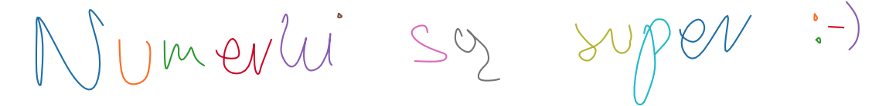

# Analiza-numeryczna---konkurs
  Konkurs polegał na opracowaniu implementacji wyznaczenia NIFS3 (naturalnych funkcji sklejanych trzeciego stopnia) i za ich pomocą odtworzyć poniższy napis.
Moje odwtorzenie powyższego napisu:

